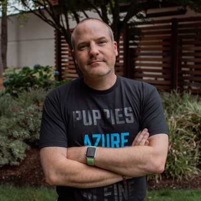

😎 **About me:**

🤖 I do things with IoT and academic advocacy in the [DevRel team at Microsoft](https://developer.microsoft.com/advocates/?WT.mc_id=academic-0000-jabenn).

---

🥱 **Longer bio**

Jim does things with IoT and Azure in the Developer Relations team at Microsoft, mainly creating content for students and faculty to help them be successful with Microsoft technologies. He’s British, so sounds way smarter than he actually is, and is happy he moved to Redmond in time to be locked down at home and not see the office he came to work in, or the places he wanted to visit. In the past he’s lived in 4 continents working as a developer in the mobile, desktop, and scientific space. He also hates cats, but has a 7 year old daughter who loves cats, so he has 2 cats.

---

❤️ **Things I love:**

---

👨‍💻**You can find me all around the web:**

---

📸 **Pictures**

Want a pic of me? Check out the [images](./images) folder.

 
